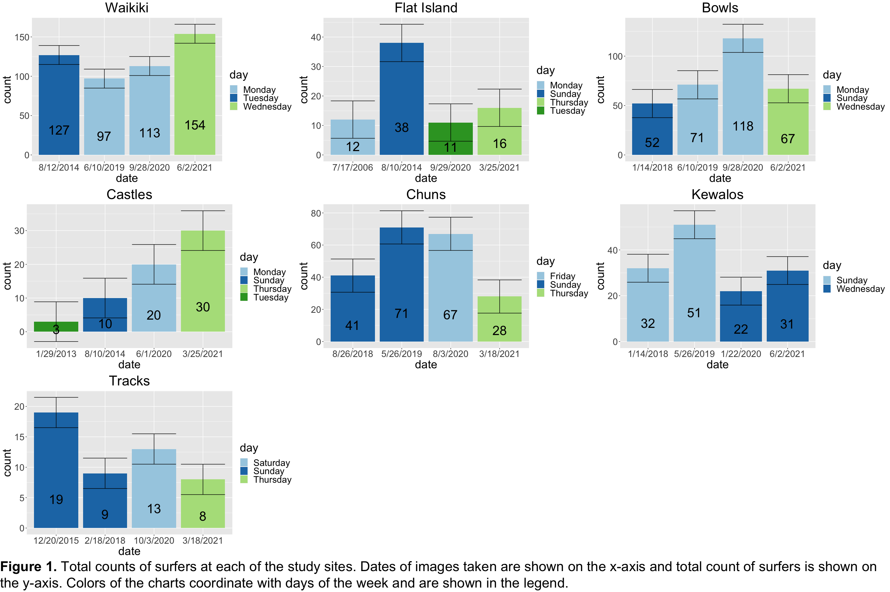
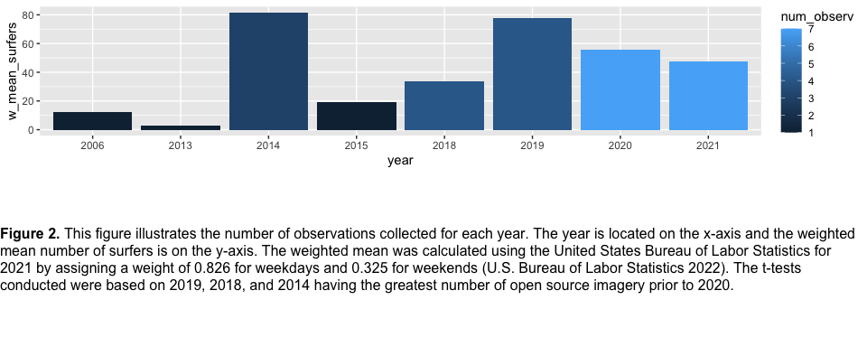
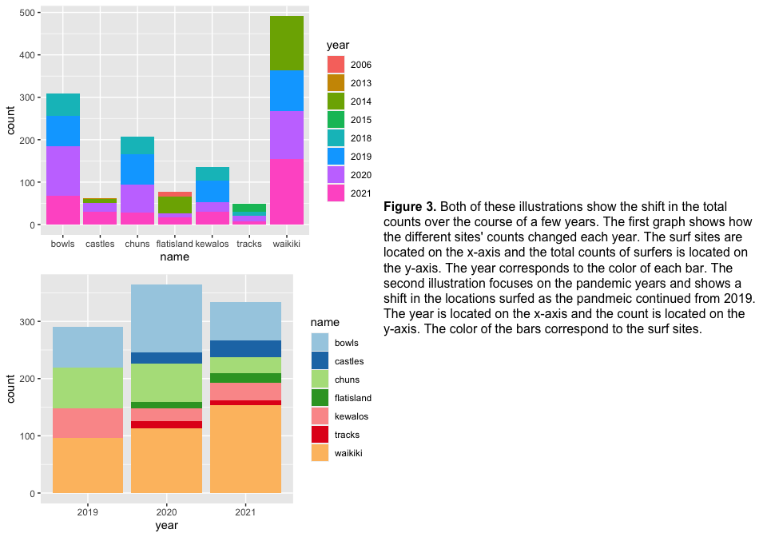

A shift in the number of surfers frequenting Oahu reef breaks before,
during, and after the COVID-19 pandemic
================
Kyleigh Kuball
2022-10-19

## Abstract

With the arrival of the Covid-19 pandemic came the stay-at-home orders,
and the world changed its habits. Oahu was no exception, and people were
no longer at work. This study aimed to answer if more people were
surfing during the 2020 stay-at-home order than in prior years. It also
aimed to see if there was a greater influx of surfers in 2021 compared
to earlier years. Using preliminary data from Google Earth Pro and ESRI
World Imagery Wayback, surfers were counted using the ImageJ multi-point
tool on multiple Oahu surf breaks in 2021, 2020, 2019, and prior years.
There were few satellite images to pick from, especially with limited
data in 2020, so the sample size remained small. Significance was found
between the total number of surfers at Bowls and Castles (p = 0.012),
Flat Island (p = 0.018), Tracks (p = 0.0076), and Waikiki (p = 0.080).
There was also a significant difference between the number of surfers at
Castles (p = 0.000057), Chuns (p = 0.0035), Flat Island (p = 0.000083),
Kewalos (p = 0.00042), and Tracks (p = 0.000040) when compared to
Waikiki. However, the small sample size led to no significance being
found between any of the years. Breaks were identified with changes that
might be significant if using drone imagery and further access to
satellite imagery was acquired. Insignificant changes were observed in
the number of people at the different breaks, and shifts were seen
between the breaks. This indicates that more imagery and the possible
expansion of the study to all the Hawaiian Islands might be significant.
Ultimately, this study’s results help identify reefs that would be
beneficial to study and observations in the future regarding the influx
of people and how that has affected them.

## Introduction

Hawaiʻi is unique in how much the economy is dominated by tourism, more
than anywhere in the mainland United States (Bond-Smith & Fuleky 2022).
However, in March 2020, Oahu went into lockdown with a stay-at-home
order. Because of this, the stay-at-home order had an enormous impact on
employment since tourism was the source of most jobs in Hawaiʻi
(Bond-Smith & Fuleky 2022). In addition, Hawaiʻi was slow to reopen
compared to the mainland U.S., and gatherings and public events were
restricted well after many states had reopened (Hallas et al. 2021). Due
to the pandemic, there was likely a shift in the number of surfers
utilizing the surf breaks around Hawaiʻi. This shift might be used to
explore further the pandemic’s impact on the vital coral reefs of the
islands within Hawaiʻi.

In 2020, people around the island of Oahu had fewer tourists around and
were still cautious of the pandemic and were trying to follow many
restrictions placed on activities and gatherings. Few options were
available during this time, and mental health can plummet with less
outdoor activity (Jackson et al., 2021). Any attempts to be outdoors on
Oahu at this time were met with restrictions such as wearing masks while
running and not being within 6 feet of people (like many other places).
Recreation on the beaches was prohibited unless it was subsistence
fishing, exercise, or water-related activities. At the start of the
pandemic, there were very few who were moving outside of their homes,
and local mobility, as seen from Google’s phone mobility data, showed
that Hawaiʻi residents were the fifth highest in staying at home when
compared to the mainland states (Hallas et al. 2021). By the summer of
2020, however, people were eager to leave and, while still under
restrictions, were leaving their homes (Hallas et al., 2021). Surfing
likely saw a boom in the number of residents paddling out on the surf
breaks during this time.

The surf breaks began to see more locals, and places that used to be
high tourism saw a shift in the number of surfers out on the surf
breaks. With tourism being greatly restricted, many people unemployed,
and strict restrictions on gatherings and activities, surfing was one of
the few activities locals could do outside their homes (Bond-Smith &
Fuleky, 2022). People were also experiencing “lockdown fatigue” and were
looking to return to a new normal, as seen by the non-essential retail
that began to increase during that time (Hallas et al., 2021).

Different breaks likely saw a shift in the number of people surfing in
the summer of 2020. Waikiki, for instance, most likely saw a drop in the
number of people since most surfing tourism tends to frequent Canoes and
Queens breaks. Closer to the west of Waikiki, the surfer population
likely increased at local town breaks like Bowls and Rockpiles. West
side and north shore breaks probably increased since more local traffic
is seen there.

While 2020 saw an enormous decrease in the number of tourists, the
following summer, there was a boom in the number of people visiting the
islands. After the reduction in 2020, tourism reached a record number in
the summer of 2021 by mainland U.S. visitors (Bond-Smith & Fuleky 2022).
This led to yet another shift on the surf breaks, and Waikiki likely saw
an uptick in the number of people, while some of the local breaks also
may have seen a change upwards as people may have shifted from their
surf breaks frequented during the pandemic.

The fluxes in surfing would be a significant find since surf breaks are
formed by the coral reefs estimated to provide 363.5 million per year in
2004 (Cesar & Beukering 2004). Fluxes in people around them might
suggest reef growth that should be explored in the future since with a
higher number of surfers can come reef damage, chemical pollutants, and
more value placed on the reefs that create the popular breaks.

This study aims to identify differences in the number of surfers at
seven different surf breaks around the island of Oahu during 2020 and
2021 compared to 2019 and previous years. By identifying differences in
the number of surfers, this study might open a path for future research
on reefs that have seen more drastic changes in the last four years.

## Methods

The breaks studied were all located on Oahu since preliminary
observations had been made there. The breaks studied were Queens and
Canoes in Waikiki, Rockpiles to Bowls at the end of Waikiki, Tracks near
Nanakuli, Chuns on North Shore, Flat Island in Kailua, Castles in
Kailua, and Kewalo Basin near Ala Moana. There are seven sites in total
around the island of Oahu.

Data sources included spatial imagery taken from either Google Earth Pro
(7.3.4.8642) or ESRI ArcGIS World Imagery Wayback
(<https://livingatlas.arcgis.com/wayback/>). This study sampled seven
sites to compensate for the low number of images available. The chosen
sites had the most open-source spatial imagery data available in less
than 3m resolution while also encompassing the island of Oahu. Less west
side surf breaks were available due to a lack of updated imagery (1
image per 2+ years), and more were used from the south shore since image
updates occur more frequently (1-3 images a year) in those locations. In
addition, due to the lack of imagery updates, only one image could be
chosen per year, even at the frequently updated locations. This was due
to either cloud cover, no surf, or no updates. Images from either
program were saved when the surf was evident in 2021, 2020, and 2019,
and the next usable image was from years prior. Since 1-3 images were
available per year and in many of them, the surf was flat/non-existent,
one image was obtained per year on a day when the surf was evident, and
surfers could be identified. Images were taken in different years at
each break prior to 2019 due to a lack of quality imagery that both had
surf and a clear view of the surfers. The years before 2019 were taken
as a control to have an extra image to compare the surfer counts from
2020 and 2021. All images and counts created are available on GitHub
(<https://github.com/kyleighk/MBIO_630_Project>) in the “counts” and
“images” files.

The images were analyzed using ImageJ (1.53t) and the multiple-point
tool. Since surfers could easily be identified, only boards were labeled
using the tool, excluding canoes, swimmers, and bodyboards. Paddleboards
were likely included in the count since paddleboards are challenging to
distinguish from a large surfboard in a satellite view of a lineup. All
counts and images of the counts were saved in a CSV file and a jpg file
to the “count” folder on GitHub.

The CSV files were then uploaded to R studio (2022.07.1) for analysis. A
table was made for each site to compare 2020 and 2021 to prior years.
All the site data was then compiled, and weights were given to each
image depending on if the image was taken on a weekday or a weekend. The
weights assigned to weekdays were (.826) and weekends were (.325) based
on the United States Bureau of Labor Statistics for 2021, in which the
total adults 21 and up that worked weekdays tended to average around
82.6%. The total number of adults 21 and up that worked weekend days was
approximately 32.5% (U.S. Bureau of Labor Statistics, 2022). A t-test
and a weighted t-test were conducted between 2020 and prior years, 2021
and prior years, and between 2020 and 2021.

## Results

The data from ImageJ was compiled by site with a data table showing the
surf break name, the date the image was taken, the year the image was
taken, the count of surfers, and the day the image was taken. This
information was then compiled into Figure 1, showing the four time
points for each of the seven sites. Figure 1 shows the number of surfers
counted at each site at each time point and is shaded with the day of
the week the image was taken. Figure 1 also highlights the time of the
week that images were available.

An ANOVA and Tukey post hoc analysis were conducted to identify
differences between the sites and the years from the data shown in
Figure 1. Significant differences were found between the count of
surfers between Castles (p = 0.012), Flat Island (p = 0.018), Tracks (p
= 0.0076), and Waikiki (p = 0.080) when compared to Bowls. Significant
differences were also found when Castles (p = 0.000057), Chuns (p =
0.0035), Flat Island (p = 0.000083), Kewalos (p = 0.00042), and Tracks
(p = 0.000040) were compared to Waikiki. When comparing the difference
in the surfers counted year to year at each site, no significant
differences were found.

Figure 2 shows the weighted mean number of surfers found each year with
the number of images that were used to obtain this mean. Since only a
small number of images were available, both a t-test and weighted t-test
were used to compare the total counts from 2020 and 2021 to the prior
years with the most counts, 2019, 2018, and 2014. No significant
differences were found between 2020 and 2019 (t = -0.81, p = 0.44;
weighted t = -0.80, p = 0.45), 2018 (t = 0.74, p = 0.48; weighted t =
0.66, p = 0.53), and 2014 (t = -0.18, p = 0.86). Similar insignificance
was found between 2021 and 2019 (t = -0.93, p = 0.38, weighted t =
-1.00, p = 0.34), 2018 (t = 0.53, p = 0.61, weighted t = 0.39, p =
0.71), and 2014(t = -0.29, p = 0.78, weighted t = -0.81, p = 0.44). The
count differences were also compared between 2020 and 2021(t = -0.16, p
= 0.87, weighted t = -0.30, p = 0.77) and no significance was found.

Figure 3 illustrates the shifts in the total counts over the years that
the images were taken. The bottom illustration shows the proportions of
the total number of surfers found before, during, and after the
stay-at-home order at the different surf sites. While the significance
is below statistical power, slight growth in 2021 can be seen in Waikiki
and Castles. Meanwhile, Bowls appears to have the greatest number of
surfers during 2020, and Chuns and Tracks appear to have kept a steady
number of surfers except for 2021. In addition, Flat Island appears to
have had a pulse of surfers in 2014.

<!-- -->

     

<!-- -->

     

<!-- -->

## Discussion

Overall, the goal of this study was to obtain a preliminary
understanding if there was a difference in the number of surfers before,
during, and after the stay-at-home order on Oahu in 2020. While there
was limited imagery, only 1-3 images per year, a beginning summary was
obtained. There appeared to be a shift in surfers around the breaks of
Oahu, and the imagery suggests that with further data, a statistical
significance might be found in the number of surfers per year between
2019, 2020, and 2021.

As expected, the number of people between the breaks was statistically
significant, with Bowls and Waikiki varying in numbers from the other
five breaks (Figure 1). The surfer population tends to run high at these
breaks, so when compared to breaks like Tracks, Flat Island, or Castles,
it seems logical that the difference is statistically significant. The
days of the week also seemed to influence the more popular breaks, with
Chuns having a greater number of people on Sunday and Friday than on
Thursday (Figure 1). Tracks, Kewalos, and Flat Island appear to have a
shift in people from weekdays to weekend days as well. Waikiki does not
seem to be as impacted by the day of the week, with weekdays having 100+
people. Similarly, Bowls had the most people counted on Mondays.

The shift from year to year is hard to determine with so few images;
however, this data does suggest further investigations. The Tukey post
hoc test used did not determine any significance between the years.
However, the graphs (Figures 1 & 3) suggest there might have been a
growth in the total number of surfers during 2021 and a decline in 2020
at Waikiki and Castles, while other sites such as Bowls may have seen
growth in 2020 and a decline in 2021. Waikiki and Castles appear to have
had a greater number of people in 2021 than in 2020 or 2019. The lowest
number of surfers for Waikiki was unexpectedly in 2019 prior to the
stay-at-home order and temporary loss of tourism. Considering that there
was a loss of tourism, surf schools, and board rentals, with further
image counts, this number might change. Kewalos appears to have a
decline in 2020, which is expected since the surf schools and board
rentals were not operating at that time. The higher count of surfers at
Bowls in 2020 might be attributed to it being a very popular spot for
town locals and, with the loss of jobs, an easy break to get to.

The lack of imagery data was surprising. Given that many popular inland
locations are updated relatively frequently, it was assumed that this
would be similar to locations such as Waikiki. Yet, even as popular as
Waikiki is, Google Earth Pro had some years in which the same image was
used in a 1–2-year streak. The same was seen in the ESRI ArcGIS imagery.
The hope of the study was to compare multiple images within a year.
However, that had to be adjusted. In the future, a broader range will be
used, such as the main Hawaiian Islands rather than just Oahu, to
increase the site sample size. The years studied will be adjusted as
well so that more imagery can be found at each site both on weekdays and
weekends, and more data will be available to compare to 2020 and 2021.
Finally, historic drone imagery (such as that taken by surf
photographers) or more frequent sensing mechanisms will be explored to
get a better picture of how the populations at the surf breaks are
changing.

In all, this study laid the groundwork for further research into the
human populations frequenting Hawaiian surf breaks, which in turn will
provide a reference when studying changes to the coral reefs that make
up the surf breaks. It is the hope of this study that this will
contribute to the research of human impact on corals and what can be
done to protect the reefs that do so much.

## References

Bond-Smith, S., & Fuleky, P. (2022). The pandemic’s effects on Hawaii’s
economy (No. 2022-4).

Cesar, H. S. J. & van Beukering, P. J. H. Economic valuation of the
coral reefs of Hawai’i. Pacific Sci. 58, 231–242 (2004).

Hallas, L., Hatibie, A., Koch, R., Majumdar, R., Pyarali, M., Wood, A.,
Hale, T. (2021) “Variation in US states’ responses to COVID-19”,
BSG-WP-2020/034 Version 3.0, Blavatnik School of Government Working
Paper Series, University of Oxford.

Jackson, S. B., Stevenson, K. T., Larson, L. R., Peterson, M. N., &
Seekamp, E. (2021). Outdoor activity participation improves adolescents’
mental health and well-being during the COVID-19 pandemic. International
Journal of Environmental Research and Public Health, 18(5), 2506.

U.S. Bureau of Labor Statistics. (2022, June 23). American Time use
Survey Summary. Retrieved October 7 2022, from
<https://www.bls.gov/charts/american-time-use/emp-by-ftpt-job-edu-p.htm>
